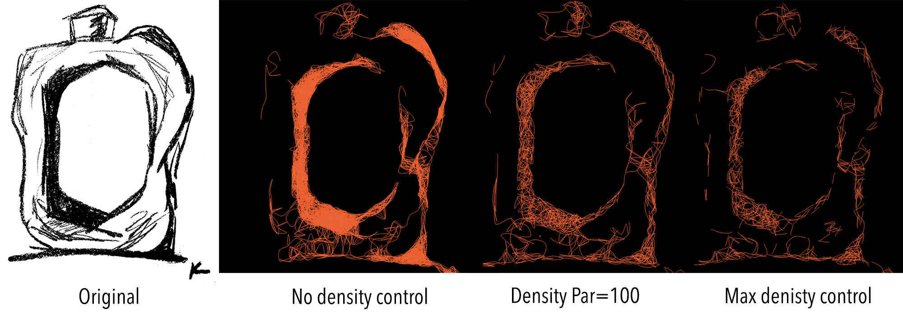
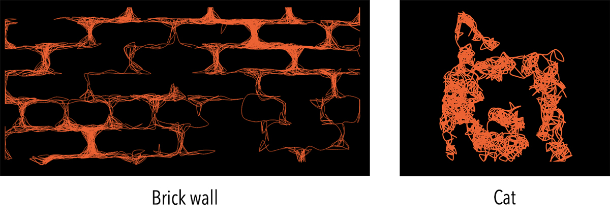
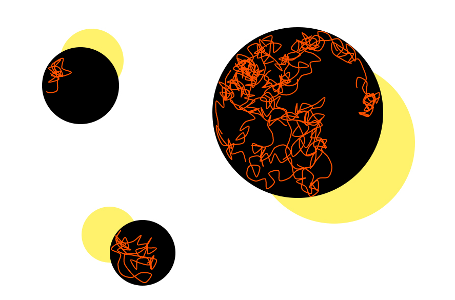

# Squiggle

This code draws a squiggly line based on the high contrast black and white photo. Some examples of the images (for a live version go to: https://ksenia007.github.io/squiggle/)

  

  

  

The code has values that can be easily changed to produce desirable results: the length of the jump from one point to new (**d**), how many steps we take in one line until starting new (**durationOneSquiggle**), control the maximum density of the line fill (**controlDensity**), the stroke weight (**strokeW**), whether to show the image or not when drawing (**showImage**) and finally the image address (**imageAddress**).

## What does the code do?

The idea behind the code - having the black/white photo we want to draw squiggly lines on top of the black region. The code starts randomly from one point, and every iteration of draw() steps distance **d** to another black pixel. If the line is too long or gets stuck - it terminates and a new one is started. 

The additional functions: 

*initNew()* - initializes the new curve from random black pixel

*getNear()* - finds a black pixel that is distance **d** from the current position

*randomPosition()* - returns [x, y] of the random position (20 pixels away from borders). 

